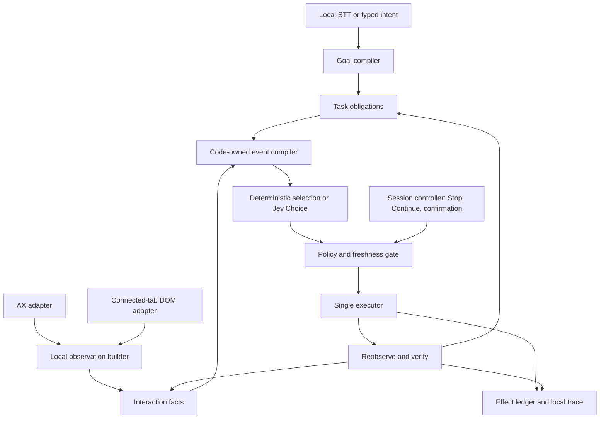

# Independent GPT-6 Astra architecture consult — how to use Jev

Requested `gpt-6-astra`, reasoning effort **xhigh**, through `codex exec` on 2026-09-20. Greenfield design against [briefs/jev-state-machine-architecture.md](briefs/jev-state-machine-architecture.md). Parent synthesis: [jev-decision-architecture.md](jev-decision-architecture.md).

---

## 1. Verdict on the state-machine + enabled-events-as-Choices idea

Adopt it with a strict division: **code establishes legality; Jev chooses among legal, grounded alternatives.**

Jev must not invent transitions, determine execution success, or supply executable arguments. Its answer is a proposal against one observation.

Use small, composable interaction machines—not a graph of every Mac application. Task recipes establish desired outcomes and dependencies; interaction machines govern suggestions, calendars, dialogs, forms, and navigation.

A unique, goal-appropriate action with proven preconditions executes without Jev. Unknown interaction state narrows the available actions; it never enables Return.

## 2. Architecture



The runner owns this loop. Adapters supply observations and execute bounded primitives. They do not plan, confirm, retry, or decide completion.

## 3. Core abstractions

| Abstraction | Responsibility |
|---|---|
| `GoalSpec` | Supported goal kind, utterance-span references, normalized constraints, completion predicates. |
| `TaskRecipe` | Code-owned obligations and dependencies; advances from verified facts. |
| `Observation` | App/window/tab identity, scoped nodes, provenance, coverage, focus, and interaction evidence. |
| `InteractionFrame` | Current protocol: suggestion picker, calendar, dialog, form, navigation; facts may be unknown. |
| `ActionCandidate` | Bound operation, target handle, value reference, preconditions, effect class, expected postcondition, semantic effect key. |
| `DecisionEnvelope` | Observation revision, candidate registry, session epoch, selected option IDs. |
| `EffectLedger` | Dispatch and verification history; prevents duplicate or unknown-effect replay. |

A goal compiler binds supported templates to selected utterance spans. Jev may resolve semantic choices among templates or spans. Code handles dates, arithmetic, normalization, URLs, identities, and dependency construction.

A semantic binding layer maps app/site observations onto reusable protocols and goal predicates. Flights warrants a maintained binding, not a fixed sequence of clicks. Unsupported goals require clarification or an explicit capability limit.

## 4. Jev request recipe

Pin `jev-1.13.0`. Send only consented, relevant text: goal constraints, current obligations, interaction facts, candidate descriptions, and recent verified progress. Exclude passwords, keys, unrelated content, and full accessibility trees.

The following is an illustrative application-level schema, not a claim about SDK field spelling:

```yaml
model: jev-1.13.0
state:
  goal:
    kind: find_flights
    origin: {span: u1, text: Zurich}
    destination: {span: u2, text: London}
    departure: 2026-09-20
    trip: one_way
  context: {observation: o7, window: w1}
  interaction:
    kind: suggestion_picker
    owner: origin
    selection_committed: false
  candidates:
    s1: {label: "Zürich", observed_context: "City"}
    s2: {label: "Zürich Airport", observed_context: "ZRH"}
questions:
  operation:
    type: Choice
    options: [select_suggestion, dismiss_overlay, clarify]
  target_if_select_suggestion:
    type: Choice
    premise: "If selecting an origin suggestion, choose the best match."
    options: [s1, s2, none]
```

Labels above illustrate observations; production labels come from the adapter.

Normalize each Choice response to:

```text
{ selectedOptionID, probabilitiesByOptionID, confidence }
```

For small sets, prefer one Choice over **fully bound action candidates**. Factor into operation and conditional target heads only when useful. Each target head receives its hypothetical premise explicitly; it cannot read the operation answer. Code consumes only the selected branch and validates its complete tuple against the original registry.

Extraction heads likewise select enumerated spans independently; code rejects inconsistent combinations. If one answer changes another question’s options, create a subsequent request.

Keep every Choice below the approximately 255-option ceiling, including reserved options. Narrow by scope and protocol; never silently truncate plausible targets.

Do not call Jev for:

- Unique, goal-appropriate transitions.
- Date calculations, calendar movement, URL construction, or identity checks.
- Confirmation enforcement, freshness, duplicate prevention, or completion proof.

Probability separation and confidence inform calibrated abstention. Neither proves correctness. `none` and `clarify` cause no execution; a suggested `finished` merely requests verification.

## 5. Adapters relative to the machine

**AX is sufficient and mandatory:** existing applications, existing Chrome, browser chrome, and all unconnected browser content.

DOM is an optional implementation of the same observation/action contract, available only for an explicitly connected tab with verified window/tab/document binding. Browser chrome remains AX.

Choose one authoritative adapter per action scope. Preserve provenance and transport-specific capabilities behind opaque handles; never fuse identities by matching labels alone.

The extension exposes shipped commands using local node handles, frame/shadow traversal, and hit testing. Jev supplies neither JavaScript nor selectors.

If DOM disconnects, reobserve through AX. Do not replay an uncertain DOM action through AX.

## 6. Session vs task vs page machines

- **Session:** inactive, active, awaiting clarification, awaiting confirmation, paused, completed. Voice Control owns command input; it never falls through to dictation.
- **Task:** bounded obligations such as trip type, committed origin, committed destination, departure date, and matching results.
- **Interaction:** a stack of local protocols, including nested overlays, driven by current observations.

Task obligations survive pauses and page changes. Interaction frames are rederived after every meaningful change.

Protocol detectors return evidence and coverage. An absent overlay in a partial observation is **unknown**, not closed. Semantic Jev judgments may rank candidates, but cannot establish missing execution prerequisites.

## 7. Verification, freshness, duplicates, Stop

Before dispatch, revalidate the candidate’s relevant app/window/document, target, overlay ownership, focus, value, and guards. Coordinate actions additionally require current geometry and hit testing. Ignore irrelevant changes; invalidate changed action dependencies.

One executor records and consumes each effect before dispatch. Adapter acknowledgment is not success. Reobserve and evaluate the declared postcondition:

- **Verified:** satisfy the obligation.
- **Proven not applied:** reconsider against fresh state.
- **Unknown:** pause without retry.

Duplicate effects never retry. Repeated no-progress states trigger a bounded progress guard.

Stop or physical mouse grab increments the session epoch, cancels pending decisions, and prevents further dispatch while preserving the goal. An already dispatched effect may complete; reconcile it without replay. Continue always reobserves. AX observation and execution are not atomic.

Only payment, destructive deletion, and external send require confirmation. Approval binds to the exact effect and relevant context. Unclassified consequential actions remain unavailable until classified; routine actions acquire no blanket confirmation prompt.

Completion requires independent, observed goal predicates—not Jev’s `finished`.

## 8. Flights walkthrough

1. **Compile the goal.** Bind Zurich and London to utterance spans. Parse September 20, 2026 in code; establish one-way travel and the results predicate. Use a code-owned Flights URL through the existing browser’s AX controls if navigation is needed.

2. **Set one-way.** Verify the selected trip type. Fulfill remaining form obligations from observed controls.

3. **Origin overlay.** Fill the origin field, then observe its suggestions. Enter the suggestion-picker protocol. Return and Search are unavailable while selection remains uncommitted. Compare Zurich/Zürich using deterministic Unicode normalization while retaining distinct city/airport identities. Select a unique appropriate option directly; otherwise ask Jev among grounded candidates. Verify committed origin and overlay closure.

4. **Destination overlay.** Repeat for London, preserving the distinction between a city-wide option and individual airports. Typed field text alone does not satisfy the obligation.

5. **Calendar.** Observe displayed month/year. Compute navigation in code and verify each month transition. Select September 20 using full date identity, excluding disabled and adjacent-month duplicates. Verify the committed departure date and calendar closure.

6. **Search.** Enable the observed Search control only after all constraints are committed and blocking interactions are proven closed. Activate it once. Never substitute an unguarded Return.

7. **Results.** Verify one-way, matching origin/destination scope, September 20, 2026, and a nonempty flight-results structure. Loading, suggestions, and an empty-results notice do not meet the acceptance bar.

This entire path must qualify through native AX without the extension.

## 9. What you reject

- A universal Mac state graph or unrestricted planner.
- Model-authored strings, selectors, scripts, or tools.
- CDP, automation browsers, profile restarts, or cloud screenshots.
- Extension-dependent acceptance.
- Fixed sleeps, blind Return, hidden adapter retries.
- Confidence as success evidence.
- Large prompts substituting for explicit interaction guards.

## 10. Open questions you could not settle

- Which AX evidence reliably proves suggestion commitment and overlay closure across supported Chrome versions?
- Which Flights result structures and city/airport semantics need maintained bindings?
- What calibrated abstention thresholds yield acceptable hands-free performance?
- Which additional task recipes deserve support after Flights?

These need native observations and evaluation fixtures. This proposal establishes architecture, not demonstrated runtime success.