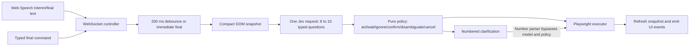

# Jev Voice Browser: source review for MacParakeet command mode

Research date: 2026-09-19. Scope: read-only source review; no app launch, dependency installation, model call, browser action, credential access, or test execution. Findings marked as risks are source-derived failure scenarios, not reproduced incidents.

## Executive verdict

This is an unusually useful small reference for **fast semantic decisions over a bounded action catalog**. Its strongest ideas are speculative question fan-out, compact semantic element candidates, explicit policy separate from classification, numbered clarification, and visible decision reasons. Those transfer directly to a native MacParakeet command experience.

It is a demonstration of the interaction pattern, not a production safety or desktop-control substrate. In particular, a numbered clarification bypasses its destructive-action gate; old partial commands can execute after a correction; element identifiers are not bound to a page generation; confirmation has no expiry; and text described as “verbatim” has filler words and punctuation removed. The feature plan should adopt the pattern while designing a stronger command transaction and genuine correction flow.

## Provenance and evidence

- Local checkout: `references/jev-voice-browser`.
- Remote: `https://github.com/moritzkremb/jev-voice-browser`.
- Reviewed commit: `054db0f3dbf537af63a8117632d3f941ccd520e1`.
- Commit timestamp: `2026-09-18T00:40:08+02:00`.
- Commit subject: `voice-browser: control a real browser by voice with Jev (TypeSafe System One) + Playwright`.
- License: MIT, copyright 2026 Moritz Kremb; preserve notice when copying substantial implementation. [License](https://github.com/moritzkremb/jev-voice-browser/blob/054db0f3dbf537af63a8117632d3f941ccd520e1/LICENSE)
- Node >=20; Express, WebSocket, Playwright and `@typesafe-ai/sdk ^0.6.0`; model pinned to `jev-1.13.0`. Dependency ranges and model identifier are this checkout's facts, not a statement of today's latest supported versions. [Package](https://github.com/moritzkremb/jev-voice-browser/blob/054db0f3dbf537af63a8117632d3f941ccd520e1/package.json), [constants](https://github.com/moritzkremb/jev-voice-browser/blob/054db0f3dbf537af63a8117632d3f941ccd520e1/src/constants.js#L15-L54)

All abbreviated source locations below are relative to this reference checkout and this exact commit. The primary source index makes them independently inspectable:

| Area | Anchored source |
| --- | --- |
| Questions, intent taxonomy, thresholds | [src/constants.js:94–317](https://github.com/moritzkremb/jev-voice-browser/blob/054db0f3dbf537af63a8117632d3f941ccd520e1/src/constants.js#L94-L317) |
| Model request/state | [src/jev.js:64–136](https://github.com/moritzkremb/jev-voice-browser/blob/054db0f3dbf537af63a8117632d3f941ccd520e1/src/jev.js#L64-L136) |
| Command orchestration | [src/controller.js:70–310](https://github.com/moritzkremb/jev-voice-browser/blob/054db0f3dbf537af63a8117632d3f941ccd520e1/src/controller.js#L70-L310) |
| Execution policy | [src/policy.js:56–227](https://github.com/moritzkremb/jev-voice-browser/blob/054db0f3dbf537af63a8117632d3f941ccd520e1/src/policy.js#L56-L227) |
| Browser actions | [src/executor.js:31–173](https://github.com/moritzkremb/jev-voice-browser/blob/054db0f3dbf537af63a8117632d3f941ccd520e1/src/executor.js#L31-L173) |
| Perception | [src/snapshot.js:12–233](https://github.com/moritzkremb/jev-voice-browser/blob/054db0f3dbf537af63a8117632d3f941ccd520e1/src/snapshot.js#L12-L233) |
| Text and URL extraction | [src/spans.js:7–151](https://github.com/moritzkremb/jev-voice-browser/blob/054db0f3dbf537af63a8117632d3f941ccd520e1/src/spans.js#L7-L151) |
| Mic UI | [src/public/index.html:291–315](https://github.com/moritzkremb/jev-voice-browser/blob/054db0f3dbf537af63a8117632d3f941ccd520e1/src/public/index.html#L291-L315) |
| On-page feedback | [src/overlay.js:6–94](https://github.com/moritzkremb/jev-voice-browser/blob/054db0f3dbf537af63a8117632d3f941ccd520e1/src/overlay.js#L6-L94) |
| Service/permissions boundary | [src/server.js:18–106](https://github.com/moritzkremb/jev-voice-browser/blob/054db0f3dbf537af63a8117632d3f941ccd520e1/src/server.js#L18-L106) |
| Browser identity and snapshots | [src/browser.js:32–125](https://github.com/moritzkremb/jev-voice-browser/blob/054db0f3dbf537af63a8117632d3f941ccd520e1/src/browser.js#L32-L125) |

## Architecture and timing

The control page uses continuous `SpeechRecognition`/`webkitSpeechRecognition`, `en-US`, interim results and only one recognition alternative. Recognition automatically restarts on `onend` while mic is enabled. Each result index is assigned an utterance ID. It does not implement acoustic VAD, push-to-talk, speaker attribution, wake words, or a separate dictation mode. Stopping the microphone only stops the recognizer; it does not send a controller cancellation. [Mic UI](https://github.com/moritzkremb/jev-voice-browser/blob/054db0f3dbf537af63a8117632d3f941ccd520e1/src/public/index.html#L291-L315)

The controller waits 200 ms after a partial update; final text schedules immediately. It allows two concurrent Jev requests, aborting older excess requests. SDK timeout is 8 seconds, with one configured retry. A snapshot older than 1.5 seconds is refreshed before asking. Completeness is model score >=0.6, recognizer final, or 900 ms without transcript change; search/type/select additionally require final or 600 ms without change. These timers measure transcript update gaps, not measured acoustic silence. An ASR stall is therefore indistinguishable from a pause. `constants.js:30–39`, `controller.js:124–205`, `jev.js:19–24`.

After executing one prefix, the controller treats at least two additional words from the same physical utterance as another virtual utterance. This is incremental chaining, not a parsed multi-step plan. It depends on the first action committing before the later text arrives. A full compound final transcript arriving at once is sent to a single-intent classifier; there is no general clause queue. If ASR revises an already consumed prefix, the entire revised update is ignored. `controller.js:74–99,129–137`.

## Complete classifier and router inventory

The implementation asks **8 unconditional questions plus 0–2 optional questions**. README references to a dozen or 9–11 do not match `buildRequest`.

| Question | Type/options | Consumer and decision |
| --- | --- | --- |
| `intent` | Choice; 16 actions/control intents plus `none` | Selects action family; >=0.55 confidence unless absent/none |
| `target` | Choice; current element IDs plus `none` | Click/type/select targeting; >=0.45 confidence and >=0.35 winning probability |
| `site` | Choice; 10 concrete sites, `the_web`, `other_named_site`, `none` | Known homepage or search-template routing; no site-confidence gate |
| `complete` | Noul | >=0.6 allows early action; final/900 ms gap bypass |
| `is_command` | Noul | >=0.5 required for ordinary commands; otherwise ignore |
| `destructive` | Noul | >=0.5 requires confirmation for concrete click/Enter/select actions only |
| `scroll_amount` | Score; little/page/end | Rounded/clamped to three levels; no confidence gate |
| `tab_direction` | Choice; next/previous/first/none | `none` or missing falls back to next; no confidence gate |
| `text_span` | Optional Choice; <=8 extracted strings plus `none` | Search/type/select payload; <0.35 falls back to first heuristic candidate |
| `url_span` | Optional Choice; <=6 normalized URL strings plus `none` | Navigation URL; <0.35 falls back to first heuristic candidate |

Source: `jev.js:64–111`, `constants.js:44–54,182–317`, `policy.js:34–38,56–227`. `destructiveIntentConfidence:0.9` exists in constants but is not used by execution policy.

### All intent/action paths

| Intent | Example | Concrete behavior and fallbacks |
| --- | --- | --- |
| `navigate_url` | “go to wikipedia”; “open example dot com” | Selected domain converted to HTTP(S); else known-site homepage; else wait for destination |
| `search_web` | “search for Alan Turing”; “search YouTube for rain” | Selected payload; named site template first, else detected on-page search box + Enter, else DuckDuckGo URL; no payload => wait |
| `click_element` | “click save”; “second result” | Confident target => click; ambiguity => up to three number overlays; no plausible target => wait |
| `type_into_field` | “type hello in the comment box” | Requires payload; confident target, else automatic search-box fallback, else numbered clarification; clears existing field before typing |
| `select_option` | “select English from the language dropdown” | Requires payload/target; executes first exact or substring match among native select options; returns false if none |
| `press_enter` | “submit”; “press Enter” | Sends Enter to current keyboard focus; destructive classification may ask confirmation |
| `scroll_down` | “down a little”; “to the bottom” | Scroll top-level window by 35% viewport, 85% viewport, or to document bottom |
| `scroll_up` | “up a page”; “back to the top” | Same magnitudes upward or to top |
| `go_back` | “back”; “undo” | Browser history back, not general reversal |
| `go_forward` | “forward” | Browser history forward |
| `reload` | “refresh” | Reload current page |
| `open_new_tab` | “new tab” | Creates and activates blank page |
| `close_tab` | “close this tab” | Closes active page; ensures at least one page remains |
| `switch_tab` | “next tab”; “previous tab”; “first tab” | Cyclic next/previous or first; <2 tabs returns false; no title-based tab search |
| `confirm` | “yes”; “do it” | With pending action and intent confidence >=0.55, immediately executes stored action; bypasses ordinary address/completeness checks; without pending => wait |
| `cancel` | “stop”; “never mind” | With pending action and >=0.55, clears it; without pending => wait; does not abort executing action |
| `none` | Fragment, side conversation | Ignore when not addressed; otherwise wait/retry |

Sources: `constants.js:94–179`; `policy.js:56–227`; `executor.js:35–173`.

Known homes are Google, DuckDuckGo, YouTube, Wikipedia, GitHub, Amazon, Reddit, Twitter/X, Hacker News and example.com. Search templates cover these except example.com, plus `the_web` as DuckDuckGo. Brand names outside the list cannot navigate without a regex-recognized domain. URL regex uses a fixed TLD list; it is not a general spoken URL grammar. `constants.js:61–88`; `spans.js:7,89–117`.

### Non-model routes and policy outcomes

- **Number selection:** while candidates are younger than 8 seconds, recognize digits, ordinals and a few ASR homophones; directly construct the saved intent + selected ID and execute without another model call or policy pass.
- **Typed command:** creates a final utterance and enters normal routing.
- **Undo UI:** directly runs browser back; bypasses ordinary classifier/policy.
- **Re-scan:** refreshes snapshot; state request returns current UI state.
- **Act:** consume prefix, clear candidates, execute, then refresh.
- **Confirm:** consume prefix, store action indefinitely, toast for 6 seconds.
- **Cancel:** consume prefix, clear pending confirmation, toast.
- **Disambiguate:** save candidate list and payload, draw 8-second overlays, schedule another silence evaluation.
- **Wait:** schedule repeated silence evaluations; no maximum age/retry count.
- **Ignore:** no retry until another transcript update.
- **Model error:** log and emit `error`; server registers no corresponding `controller.on("error")` listener in the inspected source. Node EventEmitter's special unhandled error behavior is a reliability concern.

Sources: `controller.js:61–63,110–126,174–182,233–315`; `server.js:62–99`.

## Perception and grounding

Collection scans top-level DOM interactive selectors, skips tiny/hidden elements, assigns `data-vb-id` IDs and gathers role/name/position. It stops after 400 accepted elements before viewport sorting. Compaction prioritizes viewport-visible elements, caps to 100 elements, truncates labels to 60 characters, and deduplicates `(role, truncated lowercase text, href)`. A 24,000-character guard shrinks the element list. Jev receives compact lines with IDs, role, text, placeholder, external host and below-fold marker, plus URL/title/site. `snapshot.js:12–132,183–233`; `jev.js:46–81`.

This has useful information-density discipline, but several important consequences:

1. Identical “Delete” buttons in separate rows can be collapsed, erasing the very ambiguity the UI should clarify. Parent/row/section context is absent.
2. The initial 400-element DOM-order limit can discard visible candidates before viewport ranking even starts.
3. No iframe traversal, shadow-root traversal, true accessibility name computation (`aria-labelledby`, associated labels), geometry in model state, focus state, disabled state, check state, expanded state, or supported-action list is provided.
4. The search-box heuristic gives any visible textbox +1, and accepts any positive score; an otherwise unlabelled visible text field can be treated as search. This is consequential because search automatically presses Enter.
5. IDs are stable only on a live node within a document; page navigation resets the counter. Executor resolves IDs in whichever page is currently active, without verifying page identity or captured generation.

Sources: `snapshot.js:37–63,84–121,158–170,193–205`; `executor.js:10–11,31–32`.

## Failure scenarios that should shape the feature plan

| Finding | Source-grounded scenario | Planning lesson |
| --- | --- | --- |
| Clarification bypasses risk gate | “click delete” yields ambiguous targets; “two” goes from saved candidates directly to `_runAction`, never returning through destructive policy | Clarification resolves a parameter; it must re-enter validation and authorization for the concrete action |
| Number parser can accept negation | `parseCandidatePick("not two")` has two meaningful tokens and returns the recognized number; no rejection for “not” | Grammar for fast control words must exclude negation/revisions and honor the same commitment rules |
| Stale partial may act | Request for “click save” returns after text changes to “click save actually cancel”; stale only disables final/silence, not semantic completeness | Bind execution to transcript revision; early work should prepare/highlight until chosen commitment policy allows execution |
| Pending action outlives context | Confirmation toast disappears after six seconds but pending action has no expiry or page binding; other commands do not consistently clear it | Confirmation binds action, target, document/app generation, payload and expiry |
| Stop is not interrupt | `cancel` handles pending confirmation only; mic stop does not cancel server work | A local deterministic stop path must cancel pending work and prevent future commits immediately |
| Text is not verbatim | All candidate strings pass through global filler removal and trailing punctuation deletion, including quoted text; “type please call now” loses meaningful words | Preserve original source spans/offsets and separate command-language parsing from payload bytes |
| Wrong field fallback | Uncertain type target falls back to search box; search-box detection can pick a generic visible textbox | Ask or focus an explicitly chosen target; no silent cross-field fallback for text insertion |
| Typing overwrites | Executor clears the field before typing every payload | Distinguish insert/replace/append; preview replacement and define undo receipt |
| Race across snapshot/action | Policy evaluates against mutable `this.snapshot`; executor selects mutable active page; candidate picking and Undo bypass busy admission check | One action transaction with snapshot/target identity and serialized admission for every path |
| Brittle click fallback | Failed Playwright actionability click falls back to DOM `el.click()` | Do not turn “not interactable” into synthetic success without explicit capability/policy |
| Silent retry loop | Wait/disambiguate schedules indefinitely, with minimum 50 ms retry after silence; repeated low-confidence decisions can continually call cloud | Bounded retries, cached unchanged evidence, visible unresolved state, and explicit new evidence trigger |
| Unverified success | History/reload swallow errors and return true; select takes first substring; navigation fallback accepts URL containing hostname string | Define operation-specific observable postconditions; distinguish attempted, completed and verified |

Sources: `controller.js:110–120,185–205,233–310,313–315`; `policy.js:61–70,120–127,158–165,189–193`; `spans.js:9,39–48,138–151`; `executor.js:39–46,59–76,89–98,127–142`.

These are architectural lessons, not a claim that every scenario was observed in a running session. No reference code was changed or executed for this review.

## UI/UX: what to retain and extend

**Retain:** visible listening status and interim transcript; immediate target highlight; a short action description near the controlled surface; numbered spatial clarification rather than a verbose conversation; typed fallback; and inspectable reasons explaining why an action waited. The developer dashboard shows confidence bars, gate results, model latency, action latency, token/cost estimates and snapshot candidates. These are excellent development diagnostics. `public/index.html:91–103,168–225`; `overlay.js:38–90`.

**Extend for everyday use:** a compact native HUD with Listening, Understanding, Target ready, Choose a target, Confirmation needed, Working, Done, and Could not complete states; separate speech understood from action verified; an always-available Stop action; short recoverable errors; keyboard and spoken alternatives to each numbered choice; and a stable way to recover from misheard text. Keep probability bars in an optional diagnostics view.

Overlay badges are absolute-position snapshots and do not track later layout changes. Highlight and candidate rendering automatically scroll the page, which changes the user's view before committing an action. Numbering should remain stable within a clarification transaction and update/revoke when layout or identity changes. Native overlays should be owned by MacParakeet rather than page JavaScript. `overlay.js:50–85`.

### Representative journeys

1. **Browse and search:** “Open Wikipedia” -> show destination -> navigate -> observe loaded page -> “search for Alan Turing” -> wait for payload endpoint -> submit -> verify results. Prototype already has the basic route; MacParakeet should show which search scope was selected.
2. **Ambiguous target:** “Open the second article” -> rank actual result candidates with row context -> highlight -> user says “No, the one about storage” -> recompute within the current candidate set -> execute once. Prototype has numbers but not correction/reference history.
3. **Form entry:** “Put please call now in the message field” -> preserve exact text -> focus validated field -> insert/replace according to explicit mode -> show resulting text. Prototype strips meaningful filler and clears fields.
4. **Sensitive action:** “Send this message” -> bind exact recipient/target and current draft -> ask confirmation -> “cancel” must revoke before execution. Prototype has a lightweight confirm path but lacks target/draft binding.
5. **Continuous navigation:** “New tab, open GitHub, search for Swift audio libraries” -> sequence clauses with postcondition boundaries and interrupt support. Prototype's prefix consumption is a useful low-latency experiment, not a reliable general compound-command parser.
6. **Recover:** “Undo that typing” -> restore the captured previous field state when safe; “go back” -> navigation history. Prototype conflates Undo with back, so it cannot reliably recover form changes or side effects.

## Privacy, permissions and service boundaries

Jev key stays in Node, never intentionally sent to control-page code. A separate persistent Chromium profile is the default; CDP attachment is optional. The server defaults to loopback and explicitly warns that anyone who can reach it can drive the browser. There is no application authentication, WebSocket Origin validation, session token, or fine-grained client capability admission in `server.js:49–99`; loopback is not an authenticated trust boundary.

Jev receives transcript, page URL/title, element labels and optional confirmation summary. The collector includes password inputs and uses `el.value` as a name fallback; when earlier naming sources are absent, a secret input's value can enter model context. Query strings remain in the page URL (truncated to 200 characters), and typed payloads/action descriptions appear in in-memory logs and UI state. These are concrete redaction requirements. `snapshot.js:13–33,84–93`; `jev.js:65–83`; `controller.js:47–51,228–230,290–302,318–347`.

README states its Web Speech path sends audio to Google; that is an author statement, not a network measurement in this review. The code does not select a local speech-processing implementation. MacParakeet can preserve local STT while making transcript/UI-context transfer to Jev an explicit opt-in surface. Do not carry over wholesale DOM values, hidden page data, passwords, or unrelated app content. [README privacy limitation](https://github.com/moritzkremb/jev-voice-browser/blob/054db0f3dbf537af63a8117632d3f941ccd520e1/README.md#L152-L163)

## Tests, claims and evidence limits

The source contains unit tests for span extraction, snapshot compaction, policy and controller mocks; integration tests make real model calls against four captured page fixtures plus synthetic search/form cases; demo scripts replay text partials through real browser actions. No audio recognition test is present. [Unit controller tests](https://github.com/moritzkremb/jev-voice-browser/blob/054db0f3dbf537af63a8117632d3f941ccd520e1/test/unit/controller.test.js#L103-L197), [integration cases](https://github.com/moritzkremb/jev-voice-browser/blob/054db0f3dbf537af63a8117632d3f941ccd520e1/test/integration/jev-decisions.test.js#L73-L140), [demo](https://github.com/moritzkremb/jev-voice-browser/blob/054db0f3dbf537af63a8117632d3f941ccd520e1/scripts/demo.js#L55-L80).

The author reports 27/27 model cases, ~330 ms average API latency, ~300 ms median, and ~700 ms cold first request; these were **not independently rerun**. Most model cases mark input final, bypassing completeness. The email-entry case verifies target/intent but not exact email payload. No model case covers native select execution, pending-confirmation freshness, interruption, stale UI, negation of candidate numbers, password redaction, or authenticated session control. The demo's upward scroll assertion is merely scrollY <900,000 and therefore weak. Each integration case asserts individually even though the aggregate report only asks >=90%. [README claims](https://github.com/moritzkremb/jev-voice-browser/blob/054db0f3dbf537af63a8117632d3f941ccd520e1/README.md#L138-L150), `test/integration/jev-decisions.test.js:99,109–140`; `scripts/demo.js:61`.

API latency is not voice-to-action latency. The code adds debounce, snapshot collection, endpoint waiting, a 180 ms click-preview wait, a 400 ms new-tab check, page settling, and 18 ms per typed character. Its last-word timers reference latest transcript updates; when partials overlap, these are not necessarily the time the actually executed words were spoken. Cost stats omit results discarded as stale/aborted and use a hardcoded price. Do not use displayed cost or aggregate success as a production budget/accuracy guarantee. `executor.js:14–23,58,76`; `controller.js:185–197,211,285–298`; `jev.js:33–35`.

## Recommendations for MacParakeet

1. **Adopt a typed action catalog and pure policy layer.** Jev selects among explicit capabilities; ordinary code constructs/executes validated actions. Keep question definitions versioned alongside per-route evaluation fixtures.
2. **Use shared semantic target records across browser DOM and native AX adapters.** Include app/window/document identity, generation, role, accessible name, parent context, supported actions and state. Preserve distinct repeated controls.
3. **Treat a command as a transaction.** Capture utterance/revision, UI snapshot, candidate set, concrete action, policy outcome, confirmation when needed, execution receipt and verification. All shortcuts re-enter this transaction.
4. **Build interaction repair as a first-class feature.** Numbered choices, “no, the other one,” replace a parameter, repeat, stop, cancel and scoped undo should be explicit states/routes, not incidental intent labels.
5. **Make text insertion exact.** Prefer source spans with offsets; separate spoken URL/email normalization from ordinary dictation and show the transformed value. Distinguish append, insert, replace and search.
6. **Prepare early, commit deliberately.** Measure which low-risk routes safely benefit from partials. Do not assume model completeness makes future correction impossible. Free text needs actual endpoint policy and transcript-revision handling.
7. **Bound context and retry work.** Candidate retrieval should reduce state while retaining identity/relationships. Stop repeating the same unanswered cloud query; wait for new speech, new UI evidence or explicit retry.
8. **Verify action outcomes independently.** New focus, changed value, selected option, moved scroll position, navigation identity, or changed dialog state are concrete checks. Failure must remain visible and recoverable.
9. **Separate private capture from cloud decisions.** Local audio/STT; explicit Jev context consent; redact password fields, URL secrets and unnecessary text before request assembly; local diagnostics should be optional and short-lived.
10. **Evaluate real journeys, not only intent accuracy.** Track cold/warm p50/p95 end-of-speech-to-highlight and to-verified-action, task completion, wrong-target rate, unwanted action rate, interruption success, recovery turns, exact payload preservation, context leakage and candidate coverage.

The browser-specific executor should be an adapter. Its decision architecture is broadly applicable to native macOS, but browser-history Undo, DOM IDs, search-template assumptions, top-level scrolling and page-owned overlays should not become universal desktop semantics.
