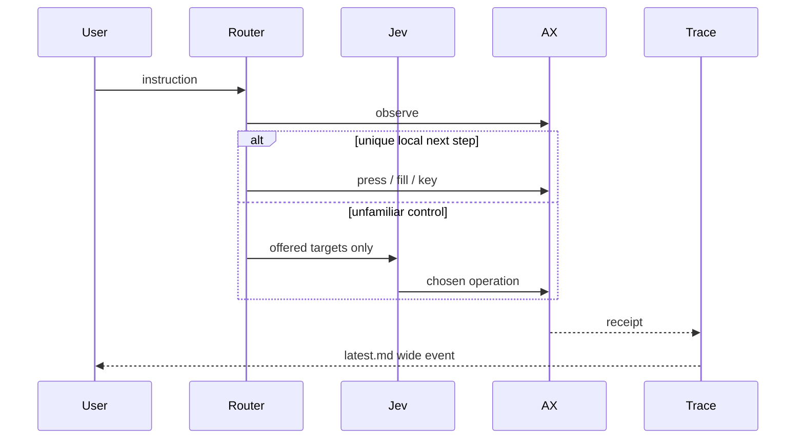

<!-- Local draft for the GitHub PR. Links are relative to the repository root. -->

## Voice commands that act in the app already open

This adds an explicitly enabled Voice Control experiment: hold Control–Option–Space, say or type an instruction, and let local routes or Jev choose bounded actions against the current macOS Accessibility interface. Browsers use the same native adapter as other apps. There is no required extension, debugging port, separate browser profile, or browser restart.

The feature remains disabled by default; DEBUG builds can expose it with `--enable-voice-control`. This PR is a developer experiment, not a stable-release claim. Native Google Flights has opened the site and filled Zurich/London/date in a live typed turn, then stalled on the origin overlay. Results-list completion and integrated microphone qualification are still open.

## Behavior and architecture

Command capture shares the existing microphone stream and STT scheduler, while bypassing dictation formatting, snippet expansion, normal history insertion, and paste. Existing dictation keeps its meaning. A nonactivating panel supports typed instructions, hold-to-talk, explicit hands-free capture, BYO Jev credentials, corrections, task history, and local diagnostics. Selected-text rewrites continue through the configured Transform writing provider under separate consent.

The router handles unique next steps locally: allowlisted site opens, Google Flights form filling, YouTube/Maps/Wikipedia/web-search boxes, unique Gmail Compose, exact clicks, and app activation. Jev is never offered `role=url` destinations. Semantic leftover controls go to Jev. Every effect is bound to a fresh observation and revocable authority. Ordinary navigation, field edits, and search run without repeated confirmation. Payment, destructive actions, and send require an action-bound check. Interface changes are distinguished from verified effects; uncertain effects cannot replay automatically.

Corrections preserve the goal and effect history. Manual keyboard/mouse interaction pauses automation; Continue observes the user's edits before replanning. Stop invalidates queued work and pending confirmations. The experimental loop has finite budgets of 40 effects, 100 decisions, and 180 seconds of active automation, excluding human waiting time.

After a turn, agents should read `/tmp/macparakeet-voice-control/latest.md` (one wide event) then `latest.json` (joinable steps). Local logs may include the instruction and control labels. Copy diagnostics omits those. Field values, selected text, audio, screenshots, and remote Jev bodies stay out.

## Privacy and scope

Speech stays local. Explicit Jev consent permits sending the command and bounded visible control context; writing-provider consent is separate. The key lives in Keychain. Recognized secret fields and configured password-manager apps are excluded. Known browser account badges are minimized, but arbitrary page content is not claimed to be universally redacted.

The previous extension experiment is preserved as uncompiled historical research. Its demo is not native browser proof. There is no public Voice Control CLI, general coordinate/OCR fallback, or qualified autonomous booking/sending workflow in this PR.

## Validation and remaining gaps

Focused `swift test --filter VoiceControl` is the local gate for this PR. Full-suite and remote CI should be recorded on the hosted checks. Live Flights results, integrated voice, and signed GUI qualification remain pending. No purchase or booking is authorized.

Read [findings](docs/research/2026-09-19-jev-voice-control/findings-2026-09-20.md), [the testing handoff](docs/research/2026-09-19-jev-voice-control/testing-handoff.md), [behavior contract](spec/contracts/voice-control.md), and [capability matrix](docs/research/2026-09-19-jev-voice-control/release-scope.md).
