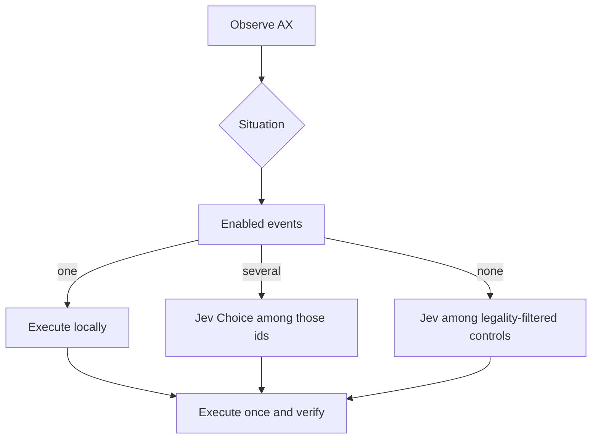

<!-- Local draft for the GitHub PR. Links are relative to the repository root. -->

## Summary

Adds an explicitly enabled Voice Control experiment: hold Control–Option–Space (or type an inbox command) and let native macOS Accessibility drive the app already in front of you, including the user’s existing browser. No required extension, CDP, or special browser profile.

Unique next steps stay local. When several events are legal — competing city suggestions — Jev makes one Choice among those ids. Return is not enabled while a suggestion or date picker is open. Confirm only pay, delete, or send.

This is a DEBUG-only developer experiment (`--enable-voice-control`). It is not a stable-release claim. Live ZRH→LON results and the integrated microphone are still unproven.

## Design

Governing decisions: [ADR-033](spec/adr/033-explicit-voice-control.md), [native Accessibility direction](docs/research/2026-09-19-jev-voice-control/native-accessibility-direction.md), [contract](spec/contracts/voice-control.md), [decision architecture](docs/research/2026-09-19-jev-voice-control/jev-decision-architecture.md).

Jev Ultrafast’s Flights demo is CDP. We keep its policy (code-owned URLs/values, consume-once, no retry of uncertain mutations) and execute through native AX. Independent consults (GPT-6 Astra, Fable 5.1, Avidlive Jev Engineering) settled: host owns legality; Jev is a judge, not a planner.

## Risk surface

- Foreground AX mutation races with dictation/Transforms (existing `GUIMutationArbiter`).
- Privacy: local traces include labels; shareable copy must not. Review `VoiceControlTraceRecord.shareable()`.
- Situation classifiers are Flights-shaped (`comma`/`Airport` cities, `departure date` days). Explicit “press return” still routes locally.
- Out of scope: TTS, Jev CLI, numbered overlays, OCR, autonomous send/book, stable DMG enablement.

## Test evidence

- [x] `swift test --filter VoiceControl` — **107 tests, zero failures** (2026-09-20 local), including overlay Return exclusion, competing-city Jev events, unique Zürich local press, event-only Jev payload, unconstrained overlay omitting Return/Search, and `replace with X` no longer building an invalid range
- [x] Hosted CI `swift-test` succeeded on the previous native-AX commits of this PR
- [ ] Rebuild Dev app and typed inbox Flights goal to a **results list**
- [ ] Integrated hold-to-talk microphone path
- [ ] Full Swift suite once, as the final merge gate

Walkthrough: [walkthrough.html](docs/research/2026-09-19-jev-voice-control/walkthrough.html). Findings: [findings-2026-09-20.md](docs/research/2026-09-19-jev-voice-control/findings-2026-09-20.md).
